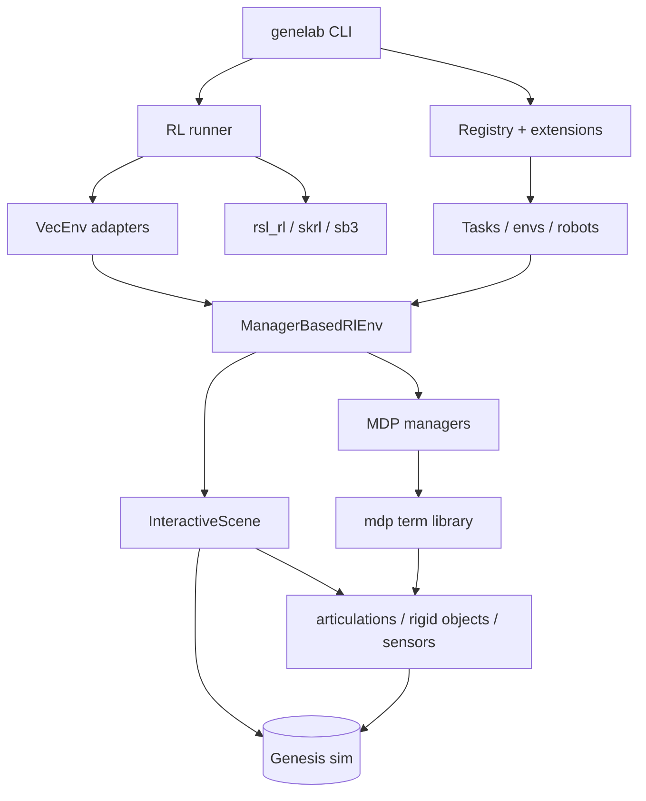
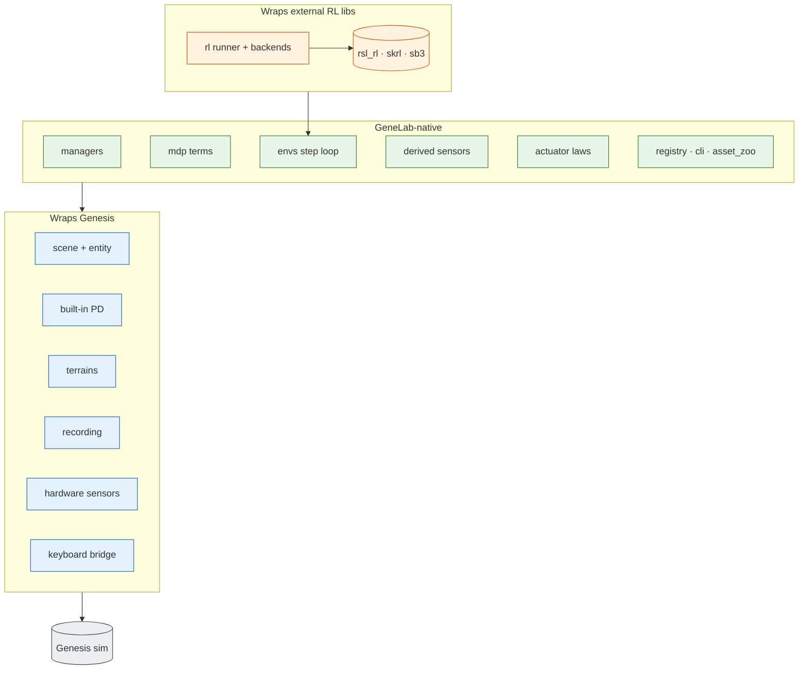

# Architecture

This page is the conceptual map of GeneLab and, in particular, where the
**boundary with the Genesis simulator** lies: which features are thin wrappers
over Genesis, which are GeneLab's own implementations, and which wrap external
RL libraries. For the import-time rules that keep the layers honest, see
[Contracts](contracts.md).

A one-line mental model:

> **GeneLab ≈ Genesis (physics backend) + a lightweight re-implementation of the
> Isaac Lab API + adapters to three RL libraries.**

## Layered overview

## What wraps Genesis vs what GeneLab implements

The abstraction seam sits at `InteractiveScene` / `Articulation` /
`Sensor.build()`. Below it Genesis owns physics, rendering, terrain heightfields
and the built-in PD controller; above it everything is GeneLab's own,
simulator-agnostic code.

The table below lists the exact packages in each bucket.

### Three categories

| Category | Packages | What it means |
|---|---|---|
| **Wraps Genesis** | `scene`, `entity`, `actuator.implicit_pd` / `mujoco_style`, `terrains`, `recording`, hardware sensors (`camera`, `mesh_ray_cast`, `tactile_*`, `proximity`, `temperature`, `kinematic_contact`), `bridges.keyboard` | a thin layer over `gs.*` calls |
| **GeneLab-native** | `managers`, `mdp` (+ DR / commands / curricula / metrics), `envs` step loop, `registry` / `extensions`, `asset_zoo`, `cli`, `utils.math`, native actuator laws (`ideal_pd`, `dc_motor`, `mlp_residual`), derived sensors (`contact`, `self_contact`, `ray_cast`, `terrain_height`, `body_velocity`, `angular_momentum`, `frame_transformer`) | own logic, no simulator coupling |
| **Wraps external RL libs** | `rl` (`runner`, `backends`, `vecenvs`, `eval_task`, `benchmark`, `exporter`) | targets `rsl_rl` / `skrl` / `sb3` / `gymnasium` — no Genesis dependency |

> Derived sensors are dual: they *read* Genesis raw data (contact forces, link
> state) but *compute* their output (air-time state machines, orbital angular
> momentum, body-frame velocities) in GeneLab.

## Terrain

Complex terrain is **generated by Genesis, not by GeneLab.** `gs.morphs.Terrain`
synthesises the procedural heightfield (stairs, slopes, rough, obstacles,
stepping-stones, fractal — Genesis reuses the IsaacGym terrain algorithms).
GeneLab only orchestrates around it:

- `terrains/generator.py` — decides which sub-terrain goes in which grid cell and
  the difficulty **curriculum** (easy → hard by row); emits the kwargs for
  `gs.morphs.Terrain`.
- `terrains/importer.py` — hands the layout to Genesis and reads the heightfield
  back for sensor sampling.
- `terrains/sub_terrain.py` — per-sub-terrain parameter configs.

So GeneLab owns the **layout + curriculum**; Genesis owns the **heightfield
synthesis**.

## See also

- [Contracts](contracts.md) — import-layering rules.
- [Managers and MDP terms](managers.md) — the manager pipeline in detail.
- [RL runner](rl-runner.md) — backend dispatch and VecEnv adapters.
- [Terrains](terrains.md) — terrain configuration in depth.
