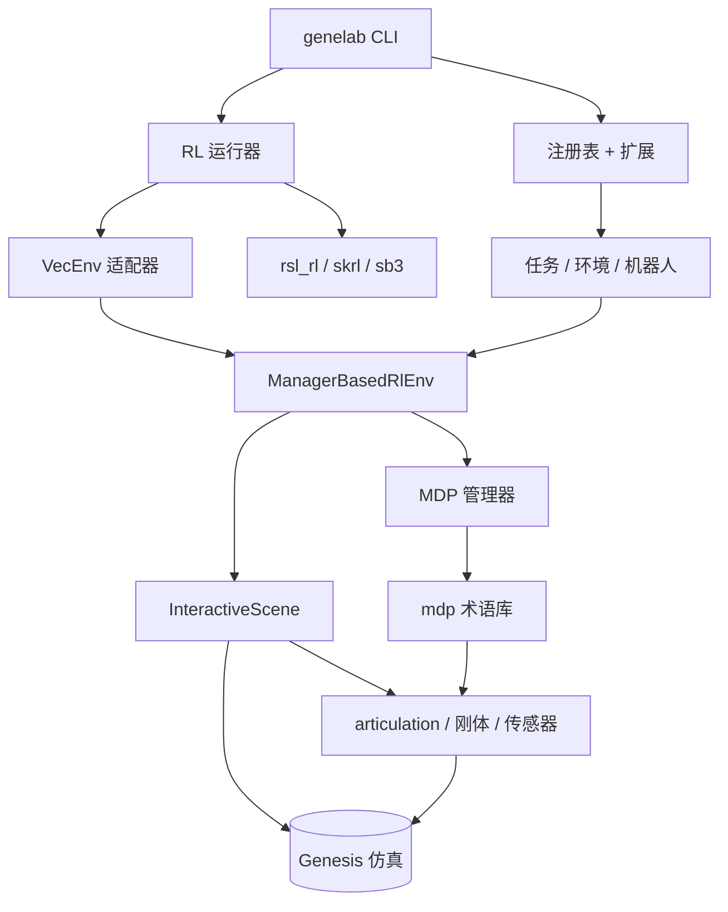
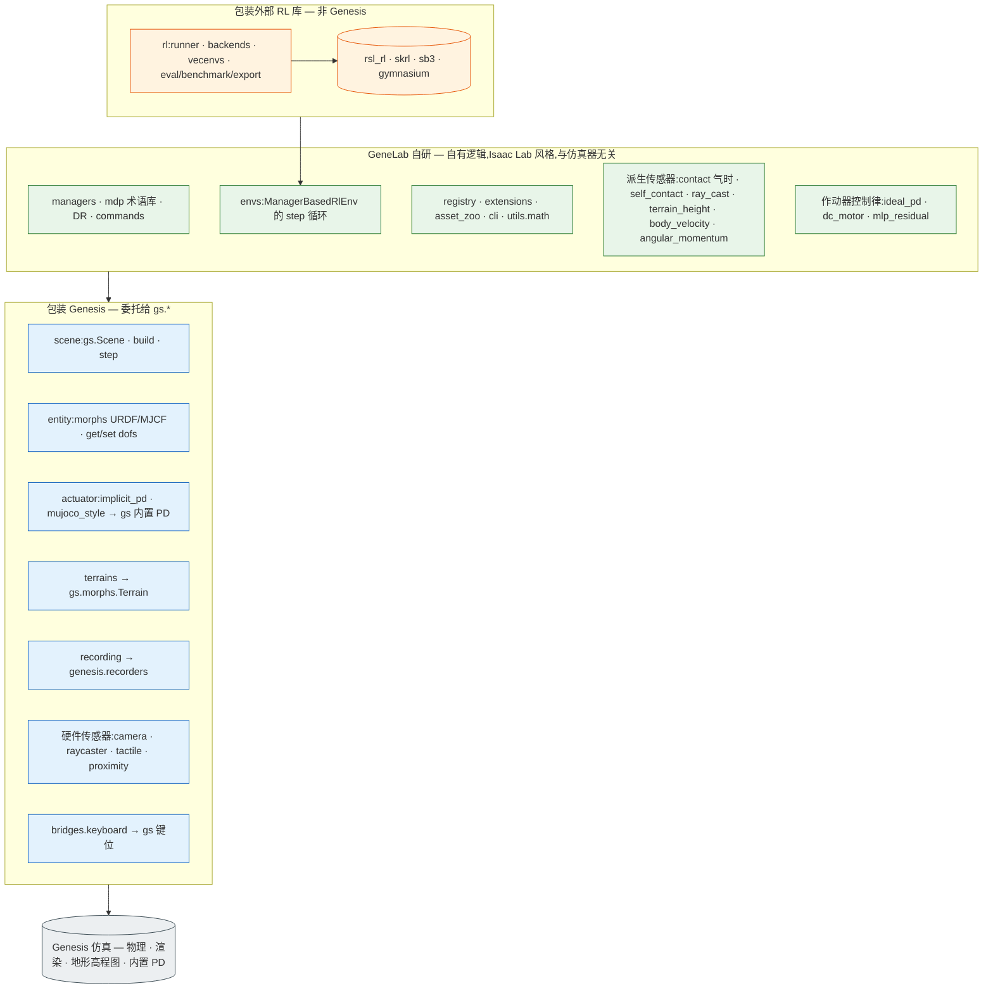

# 架构

本页是 GeneLab 的概念地图,重点说明**与 Genesis 仿真器的边界**:哪些功能是
对 Genesis 的薄封装,哪些是 GeneLab 自有实现,哪些是对外部 RL 库的封装。关于
保持各层边界的导入期规则,见[契约](contracts.md)。

一句话心智模型:

> **GeneLab ≈ Genesis(物理后端)+「Isaac Lab API 的轻量重实现」+ 三个 RL 库
> 的适配器。**

## 分层概览

## 哪些包装 Genesis,哪些是 GeneLab 自研

抽象接缝落在 `InteractiveScene` / `Articulation` / `Sensor.build()`——其下由
Genesis 负责物理、渲染、地形高程图与内置 PD;其上全是 GeneLab 自有、与仿真器
无关的代码。

### 三类划分

| 类别 | 模块 | 含义 |
|---|---|---|
| **包装 Genesis** | `scene`、`entity`、`actuator.implicit_pd` / `mujoco_style`、`terrains`、`recording`、硬件类传感器(`camera`、`mesh_ray_cast`、`tactile_*`、`proximity`、`temperature`、`kinematic_contact`)、`bridges.keyboard` | 对 `gs.*` 调用的薄封装 |
| **GeneLab 自研** | `managers`、`mdp`(含 DR / commands / curricula / metrics)、`envs` step 循环、`registry` / `extensions`、`asset_zoo`、`cli`、`utils.math`、自有作动器控制律(`ideal_pd`、`dc_motor`、`mlp_residual`)、派生传感器(`contact`、`self_contact`、`ray_cast`、`terrain_height`、`body_velocity`、`angular_momentum`、`frame_transformer`) | 自有逻辑,不与仿真器耦合 |
| **包装外部 RL 库** | `rl`(`runner`、`backends`、`vecenvs`、`eval_task`、`benchmark`、`exporter`) | 面向 `rsl_rl` / `skrl` / `sb3` / `gymnasium`——不依赖 Genesis |

> 派生传感器具有双重性:它们*读取* Genesis 原始数据(接触力、连杆状态),但
> 在 GeneLab 里*计算*输出(气时状态机、轨道角动量、机体系速度)。

## 地形

复杂地形由 **Genesis 生成,而非 GeneLab。** `gs.morphs.Terrain` 合成程序化高程图
(楼梯、斜坡、起伏、障碍、踏石、分形——Genesis 沿用 IsaacGym 的地形算法)。
GeneLab 只在其外围做编排:

- `terrains/generator.py`——决定哪种子地形放哪个网格单元,以及难度**课程**
  (按行从易到难);生成 `gs.morphs.Terrain` 的 kwargs。
- `terrains/importer.py`——把布局交给 Genesis,并回读高程图供传感器采样。
- `terrains/sub_terrain.py`——各子地形的参数配置。

也就是说:GeneLab 拥有**布局 + 课程**;Genesis 拥有**高程图合成**。

## 延伸阅读

- [契约](contracts.md)——导入分层规则。
- [Manager 与 MDP term](managers.md)——管理器流水线细节。
- [RL runner](rl-runner.md)——后端分发与 VecEnv 适配器。
- [地形](terrains.md)——地形配置详解。
